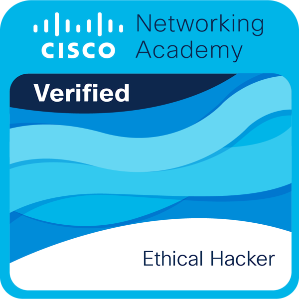
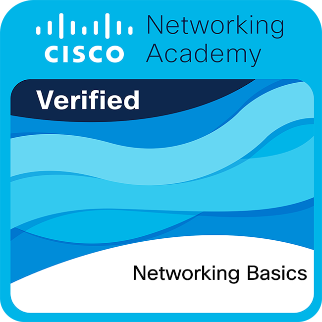
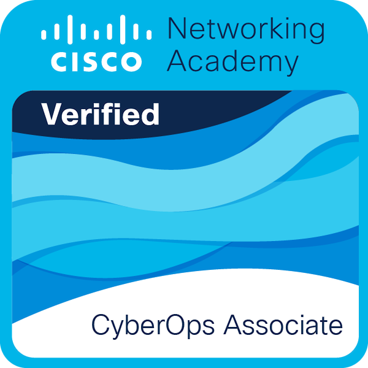
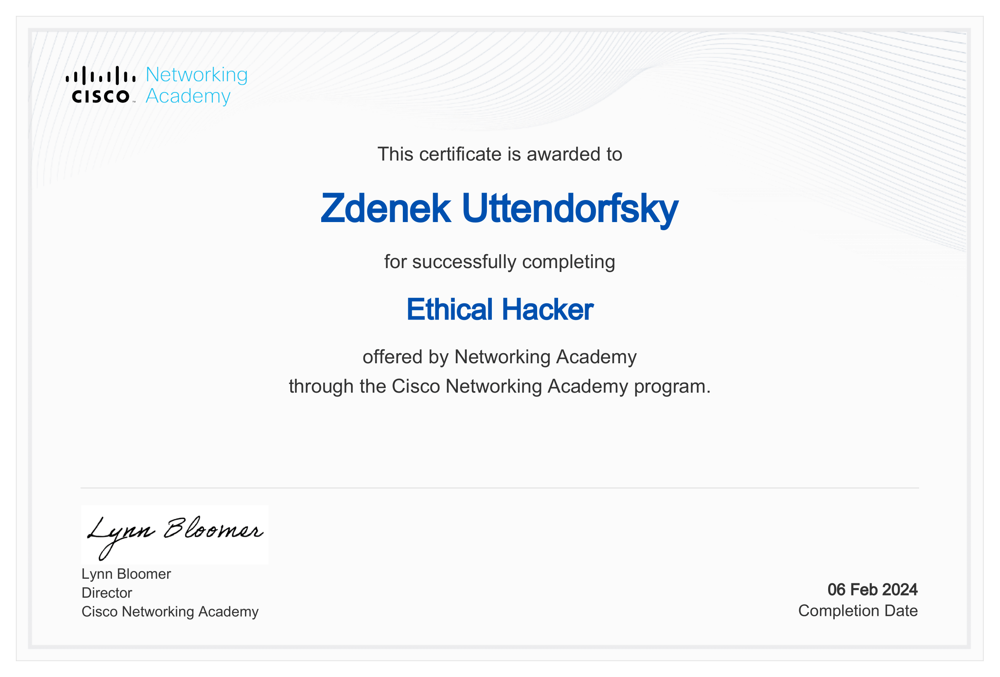
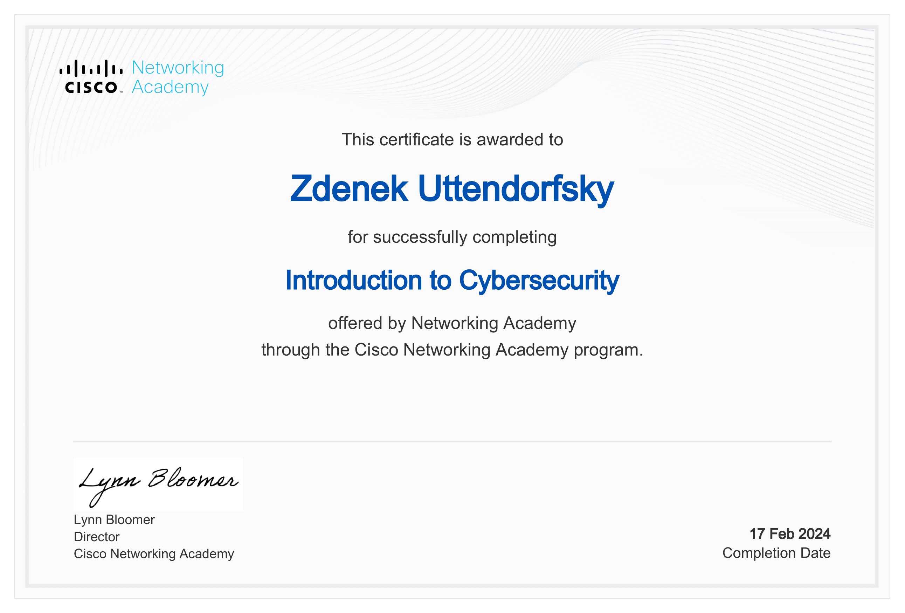
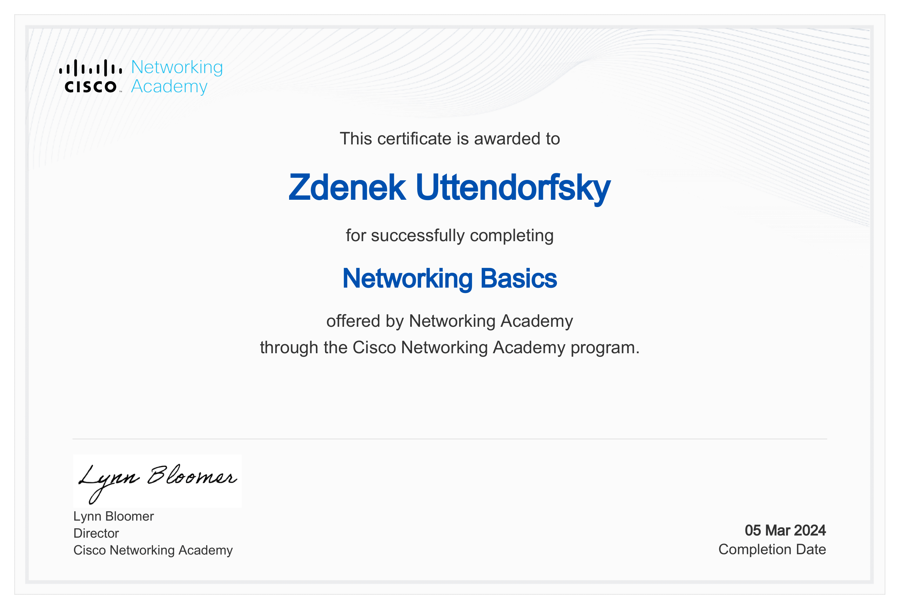
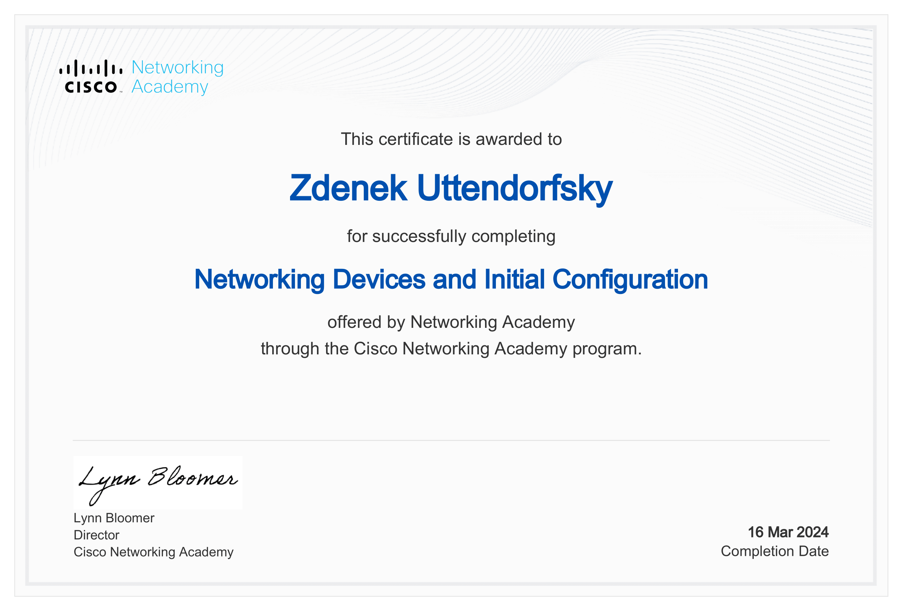
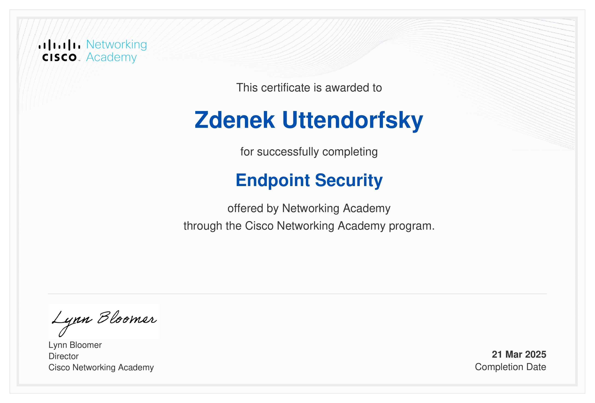
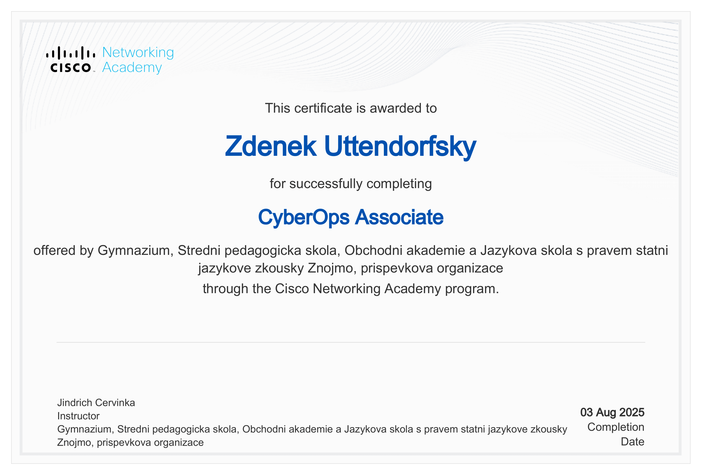

 

[//]: <> (GitHub stats and most used languages)

 

  <h2>Cisco Badges</h2>
  

  <a href="https://www.linkedin.com/in/zden%C4%9Bk-uttendorfsk%C3%BD-464008295/" target="_blank">
    
    
    
     
    
    
  </a>

 
  <h2>Cisco Certificates</h2>
  

    
    
    
    
    
    

 

  <h2>THM Certificates</h2>
  

  
  
  

  

  
  
  

  

  
  
  

